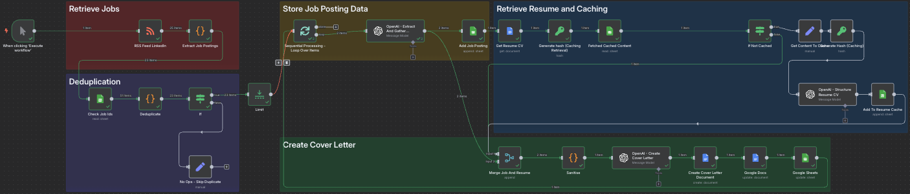

### Quick Setup Guide

Here are the key steps to get job search automation up and running with n8n.

What you need:

- Google Cloud Developer account
- OpenAI API key

1. **Import the .json file to n8n**

2. **Generate RSS Feed**
   _ First, head over to [RSS.app](https://www.rss.app/) to generate your LinkedIn job feed.
   _ Paste the URL below to generate the LinkedIn feed, modifying the geoId number based on the location that you want (you can find it in the URL when you change locations.
   _ Paste the generated XML link into the 'RSS Feed LinkedIn' node.
   _ Example URL to put in [RSS.app](https://www.rss.app/):
   https://www.linkedin.com/jobs/search/?geoId=101452733&keywords=software%20engineer&spellCorrectionEnabled=true

3. **Connect Google Cloud API key**

   - Create a new project.
   - On the products menu (top-left hamburger), go to APIs & Services --> Enabled APIs & services, click "+Enable APIs and services" and enable Google Sheets API and Google Drive API.
   - Next, go to OAuth consent screen --> Clients, create new client, add Client ID and Client secret to n8n Google nodes and add callback link in Authorized redirect URIs (since I run n8n locally, I put "http://localhost:5678/rest/oauth2-credential/callback").
   - Add your google account as Test users in Audience.

4. **Connect Your AI Model**

   - You'll need an API key from an AI provider, currently I'm using OpenAI with 4o-mini model.
   - Add this key to the **Chat Model** node in your n8n workflow.

5. \*\*Prepare Google sheets

   - Create a Google sheets, on the first page add fields listed in "Add Job Posting" node. This page will be the job posting list.
   - Add another page that tracks the changes in your CV, add fields listed in "Add To Resume Cache "

6. **Convert latest CV into plaintext**
   - Save a .docx version of your latest cv in a google drive and add it to the "Get Resume CV" node.
